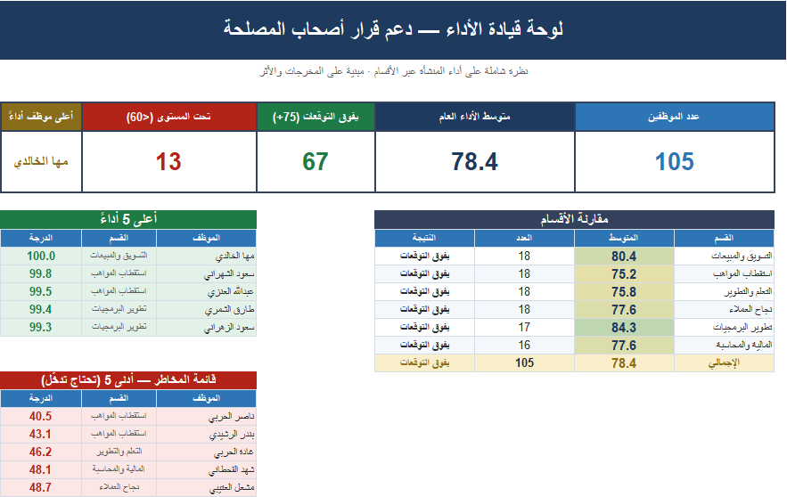
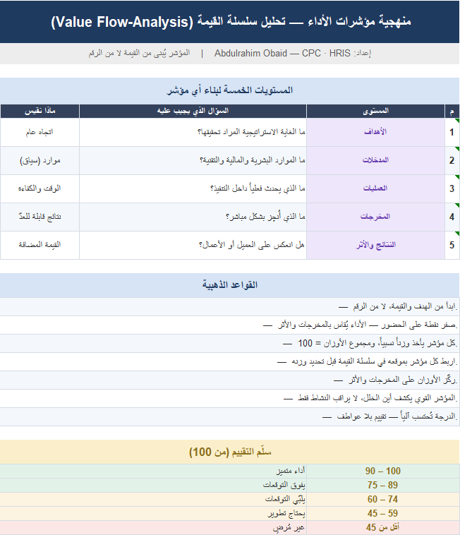
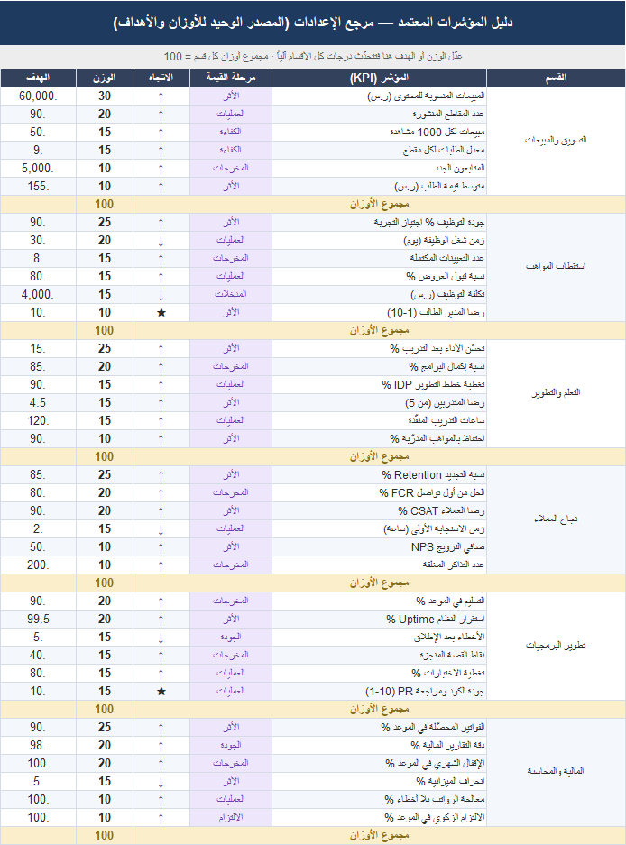
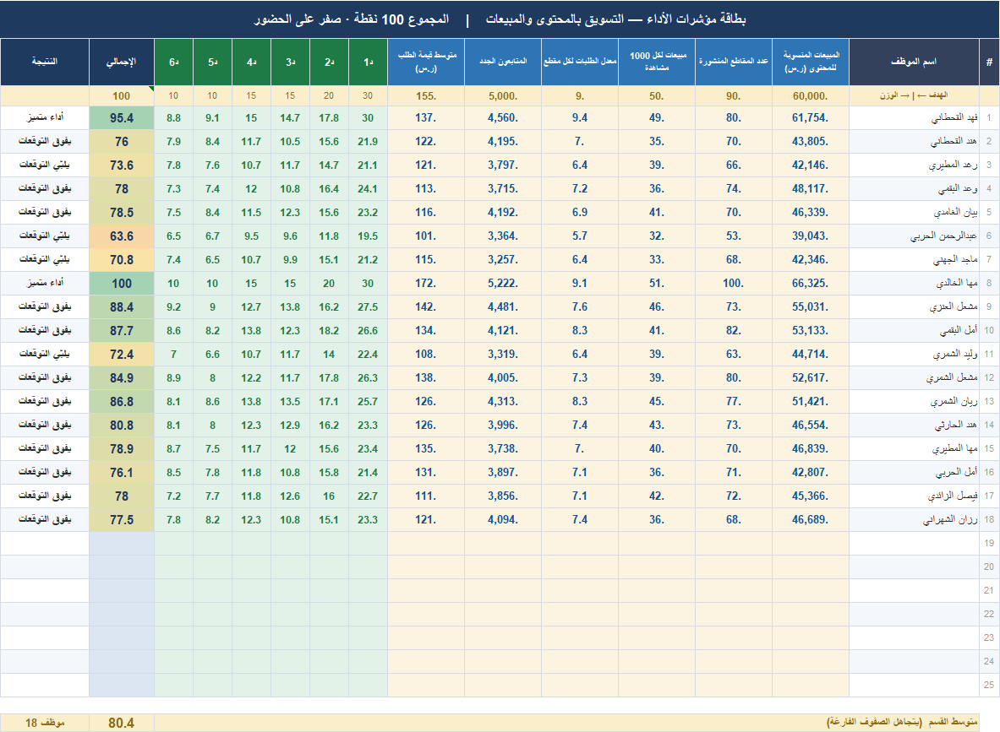
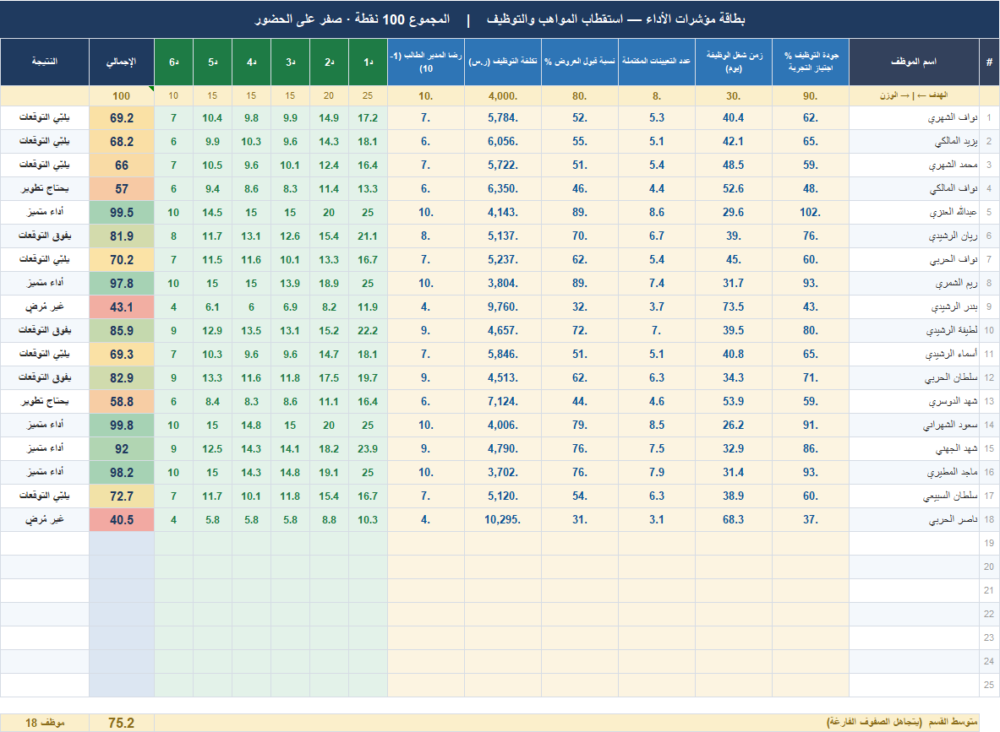
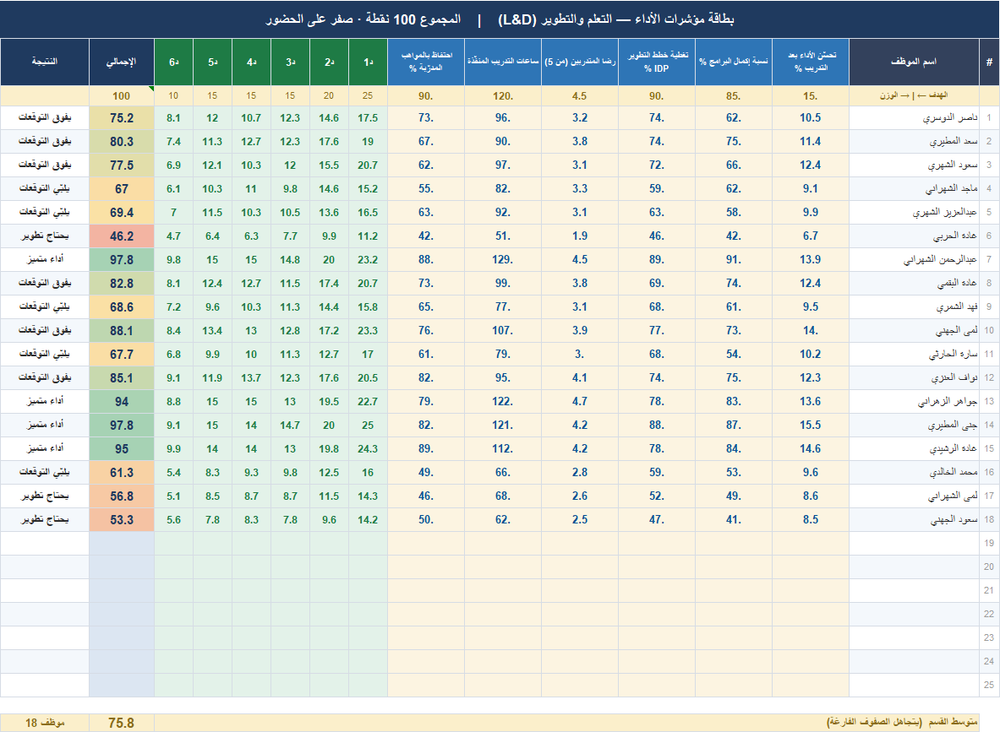
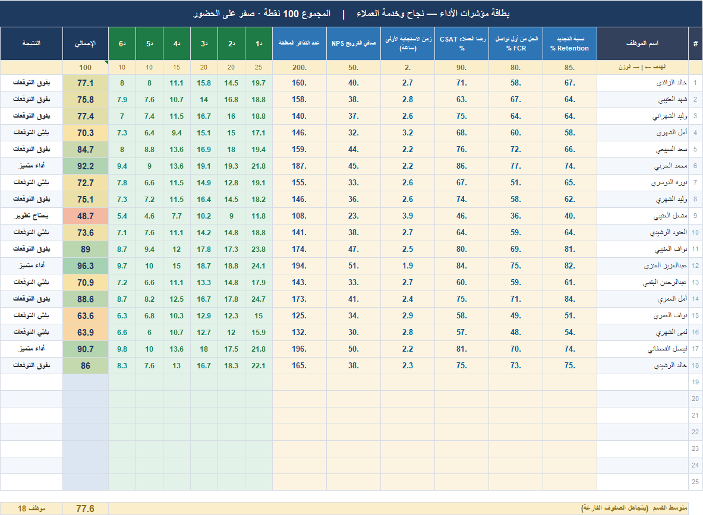
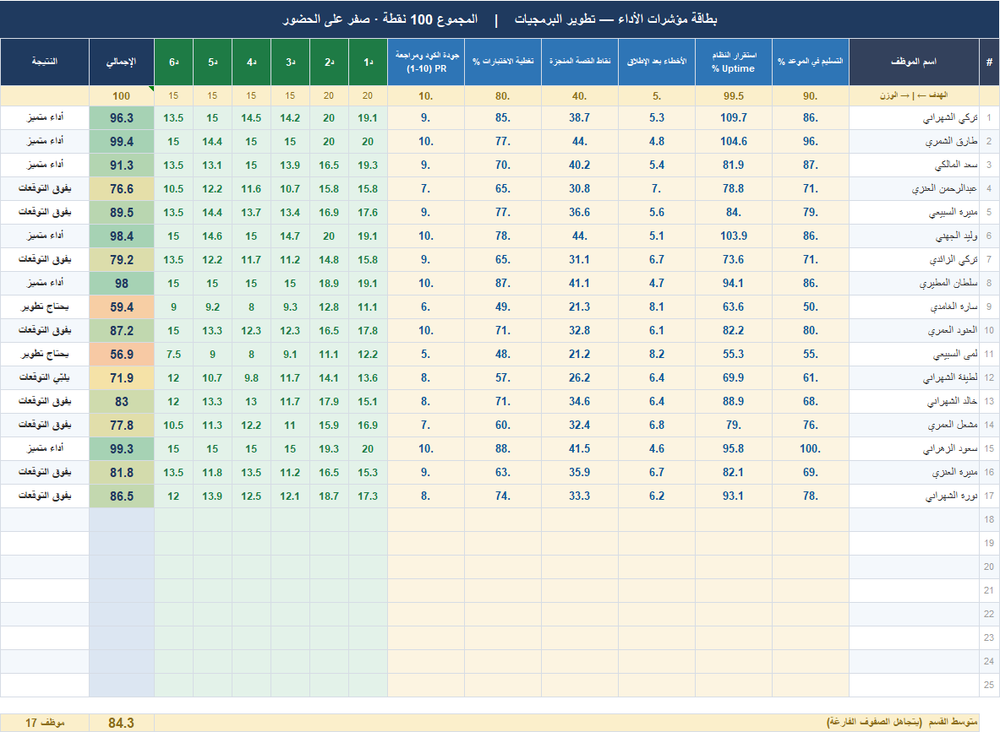
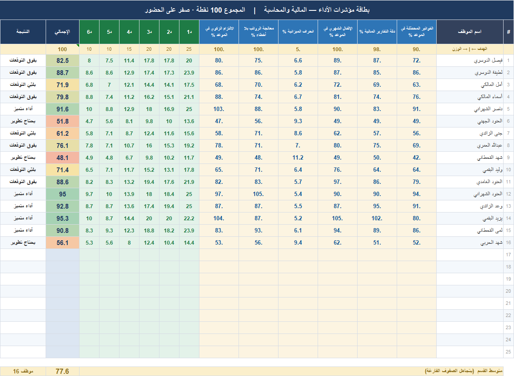

# نظام مؤشرات الأداء

منظومة مؤشرات أداء كاملة في Excel، قاعدتها: المؤشر يُعرَّف من المخرجات والأثر، لا من النشاط — التوثيق والالتزام الإداري شرط جودة يُشترط، لا أداء يُكافأ بنقاط.

تصفّح الأوراق أدناه، أو [⬇️ حمّل النظام لتفتحه في Excel](https://github.com/ab1ob/barez-kpi-system/archive/refs/heads/master.zip).

---

## لوحة القيادة

دعم قرار أصحاب المصلحة: متوسط الأداء العام، أعلى الموظفين أداءً، قائمة المخاطر التي تحتاج تدخّلاً، ومقارنة الأقسام بالنتيجة والأثر.

## المنهجية

المستويات الخمسة لبناء أي مؤشر، وقواعد التقييم.

## دليل المؤشرات

كل مؤشر موثّق: التعريف، طريقة الحساب، مستويات التقييم.

## مؤشرات الأقسام

كل قسم بأوراقه ومؤشراته المعرّفة من المخرجات والأثر.

### التسويق والمبيعات

### استقطاب المواهب

بقية الأقسام (اضغط للعرض)

### التعلم والتطوير

### نجاح العملاء

### تطوير البرمجيات

### المالية والمحاسبة

---

## الاستخدام

[حمّل النظام](https://github.com/ab1ob/barez-kpi-system/archive/refs/heads/master.zip) وافتح `نظام_مؤشرات_الأداء_بارز.xlsx` — ابدأ من «المنهجية» لفهم طريقة البناء، ثم «لوحة القيادة» لرؤية النتائج. عدّل مؤشرات كل قسم بما يطابق منشأتك.

## الرخصة

MIT — استخدمه وعدّله بحرية.

---

[الصفحة الرئيسية](https://github.com/ab1ob) · [معرض الأعمال](https://github.com/ab1ob/portfolio)

